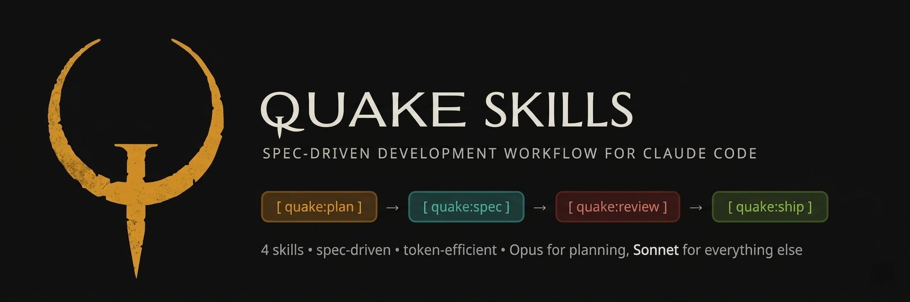

# ⚡ Quake Skills

<p align="center">
  
</p>

**A token-efficient, spec-driven development workflow for Claude Code.**

4 skills. 4x damage. Plan before you code. Ship clean.

Inspired by the discipline of arena combat — every shot counts, no wasted ammo. Quake Skills enforces a structured workflow that catches mistakes before they become code, saving tokens and producing better software.

---

## The Workflow

```
                    ┌─────────────────────────────────┐
                    │         /quake:plan              │
                    │    Architect the feature         │
                    │    Outputs tasks + decisions     │
                    │    Model: Opus                   │
                    └──────────────┬──────────────────┘
                                   │
                          [approve plan]
                                   │
                    ┌──────────────▼──────────────────┐
                    │         /quake:spec              │
                    │    Define contracts + tests      │
                    │    Then implement per task       │
                    │    Model: Sonnet                 │
                    │                                  │
                    │    ┌────────────────────────┐    │
                    │    │  For each task:         │    │
                    │    │  1. Implement           │    │
                    │    │  2. Write tests         │    │
                    │    │  3. Run tests           │    │
                    │    │  4. git commit          │    │
                    │    │  5. Next task            │    │
                    │    └────────────────────────┘    │
                    └──────────────┬──────────────────┘
                                   │
                          [all tasks done]
                                   │
                    ┌──────────────▼──────────────────┐
                    │        /quake:review             │
                    │    Spec compliance + security    │
                    │    + patterns + test suite       │
                    │    Model: Sonnet                 │
                    │    (--thorough for Opus)         │
                    └──────────────┬──────────────────┘
                                   │
                          [review passes]
                                   │
                    ┌──────────────▼──────────────────┐
                    │         /quake:ship              │
                    │    Push + create PR              │
                    │    No commits (already done)     │
                    │    Model: Sonnet                 │
                    └──────────────┬──────────────────┘
                                   │
                              [shipped]
```

---

## Skills

| Skill | Model | What it does |
|---|---|---|
| `quake:plan` | **Opus** | Produces an architectural plan with numbered tasks, decisions, and file map. No code — just the blueprint. |
| `quake:spec` | **Sonnet** | Defines behavioral contracts, interfaces, edge cases, and test expectations per task. Then executes implementation with per-task commits. |
| `quake:review` | **Sonnet** | Reviews the full diff against the spec. Checks spec compliance, security, codebase patterns, correctness, and test coverage. Use `--thorough` for Opus on critical changes. |
| `quake:ship` | **Sonnet** | Pushes the branch and creates a clean PR. Refuses to run if there are uncommitted changes. |

---

## Installation

### Claude Code (Terminal)

Copy the skills to your global Claude skills directory:

```bash
# Clone this repo
git clone https://github.com/YOUR_USERNAME/quake-skills.git

# Copy to global skills (available in all projects)
cp -r quake-skills/.claude/skills/quake-* ~/.claude/skills/

# Or copy to a specific project (shared via git)
cp -r quake-skills/.claude/skills/quake-* your-project/.claude/skills/
```

Verify they're loaded:

```bash
# In Claude Code, type:
/quake:plan
```

### Claude Code on Web / Mobile

Commit the skills to your project repo:

```
your-project/
└── .claude/
    └── skills/
        ├── quake-plan/
        │   └── SKILL.md
        ├── quake-spec/
        │   └── SKILL.md
        ├── quake-review/
        │   └── SKILL.md
        └── quake-ship/
            └── SKILL.md
```

The cloud environment clones your repo and discovers the skills automatically. You can invoke them via slash commands or conversationally ("use quake:plan to plan this feature").

---

## Usage

### Full workflow with GitHub Issues

```
1. Create a GitHub issue describing the feature
2. /quake:plan implement #42
3. Review the plan → say "looks good"
4. /quake:spec
5. Review the spec → say "go"
6. [tasks execute with per-task commits]
7. /quake:review
8. /quake:ship
```

### Quick examples

**Plan a feature:**
```
/quake:plan Add password reset flow using Next.js 14 + Drizzle + Resend
```

**Plan from a GitHub issue:**
```
/quake:plan implement https://github.com/user/repo/issues/42
```

**Review with extra scrutiny (auth/payments):**
```
/quake:review --thorough
```

**Ship as draft PR:**
```
/quake:ship --draft
```

---

## Token Efficiency

This workflow is designed for personal projects where every token counts.

**Two checkpoints before code:** Plan and spec are lightweight documents (~2k tokens each). If the direction is wrong, you fix a 60-line doc instead of regenerating hundreds of lines of code.

**Opus only where it matters:** Planning requires architectural reasoning — Opus pays for itself here. Everything else runs on Sonnet. Roughly 50-60% cost reduction vs all-Opus.

**Task-based implementation:** If task 3 of 4 fails, you've already committed tasks 1-2. Retry just the failed task, not everything.

**No unnecessary skill invocations:** Per-task commits are inline `git commit` — no skill loaded. `quake:ship` only fires once for the final PR.

| Step | ~Tokens | Model |
|---|---|---|
| Plan | ~2,000 | Opus |
| Spec | ~1,500 | Sonnet |
| Implement (per task) | varies | Sonnet |
| Review | ~3,000 | Sonnet |
| Ship | ~1,000 | Sonnet |

---

## Works with Superpowers

[Superpowers](https://github.com/obra/superpowers) is complementary:

- Use Superpowers' **brainstorming** for complex features where you're not sure _what_ to build yet (before `quake:plan`)
- Use Superpowers' **TDD enforcement** when correctness is critical
- Use **Quake** for the structured plan → spec → implement → review → ship pipeline

---

## Project Structure

```
.claude/
└── skills/
    ├── quake-plan/
    │   └── SKILL.md        # Architecture + task planning
    ├── quake-spec/
    │   └── SKILL.md        # Spec + implementation execution
    ├── quake-review/
    │   └── SKILL.md        # Code review against spec
    └── quake-ship/
        └── SKILL.md        # Push + PR creation
```

---

## Contributing

This is a personal workflow — fork it and make it yours. Some ideas:

- Add a `quake:impl` skill to separate spec generation from implementation
- Add `--parallel` review agents for large PRs
- Create framework-specific plan templates

---

## License

MIT

---

*"In the arena, hesitation kills. In code, planning saves."*
